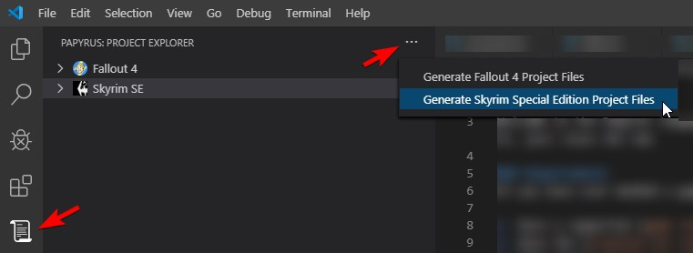
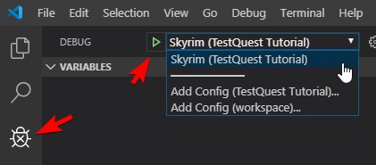

# New in Papyrus for VSCode!

## Debugger

-   You can now debug scripts in Skyrim AE, thanks to the hard work of nikitalita! This also includes improvements under the hood that will enable us to add more features in the future and ensure compatibility with future releases of Skyrim and Fallout 4.

### It is now necessary to install the Address Library mods for debugging to work!

-   You can download them here: https://github.com/nikitalita/address-library-dist/releases

Future versions of the extension will assist in locating and installing these mods as a part of the debugger setup process.

## Pyro

-   Starting in v3, Pyro has been updated and will continue to be going forward, so there's no need to copy new versions of Pyro into the extension. In the future, Pyro will be automatically updated independent of new releases of the extension.

---

# Getting Started With Papyrus for VSCode

**Welcome to the Papyrus language support VSCode extension!** This document is here to help you get up and running as quickly as possible. Once you no longer need it, just close the tab. You can open it again from the Papyrus project explorer menu if needed.

## Requirements

If you have ever modded a game that uses Papyrus before then you likely already meet these requirements.

1. Have a supported [game installed](https://github.com/joelday/papyrus-lang/wiki/Game#installation) such as Skyrim or Fallout 4.
2. Have the [Creation Kit installed](https://github.com/joelday/papyrus-lang/wiki/Creation-Kit#installation) and included [base scripts](https://github.com/joelday/papyrus-lang/wiki/Glossary#base-script) extracted. The _Creation Kit_ requires a supported game to be installed.
3. **Optionally** have [xSE](https://github.com/joelday/papyrus-lang/wiki/Glossary#script-extender-xse-skse-f4se) installed for [Debugging](https://github.com/joelday/papyrus-lang/wiki/Debugging) support.

## Configuration

First you want to check your configuration settings. You can access the configuration for the extension here:

Click on the gear and select **Configure Extension Settings**.

The main things you need to do are:

1. Enable any games you want to use the extension with and disable any games that you don't want to develop for.
2. Make sure the paths to the game install directories are correct. The game will try to find these using the Windows Registry, but it's better to explicitly define them here.
3. If you are using _Mod Organizer 2_ then you might want to set your **Mod Directory Path** for any games you plan to use. More information about using Mod Organizer 2 with the Papyrus extension [can be found here on the wiki](https://github.com/joelday/papyrus-lang/wiki/Using-Mod-Organizer-2).

So now your configuration is done and you're ready to generate some project files!

## Project File Generation

Click the little scroll icon over on the left and then select one of the **Generate Project Files** commands from the project explorer's menu.

A Select Directory window will appear and it should default to the `Data` directory inside the install folder of the game you selected. Normally this is exactly where you want to install project files, but if you're using Mod Organizer 2 with the USVFS custom overwirite capture directory feature and have the files for the mod you're developing in a different folder, you shoudld browse to the root of your mod folder and select that. If you're not sure what this means then don't worry about it and just select the game data directory which should be the default. See the wiki for more information on [Mod Organizer 2](https://github.com/joelday/papyrus-lang/wiki/Using-Mod-Organizer-2) and using it with the extension.

After that you should see a success message appear. One of the files created is a Workspace file that ends with the extension `.code-workspace`. Go to the File menu and select **File->Open Workspace...** then browse to the Data directory of the game and open the `.code-workspace` file.

## Building

You will notice that there is now a `.ppj` file in the data directory. Edit this file and add folders for any scripts you have added. You can also add specific scripts if you want. This Papyrus Project file will work even if you're using Skyrim SE or Skyrim LE because the extension uses fireundubh's Pyro build utility to parse the project file.

To build using the `.ppj` file, select **Terminal->Run Task...** and you should see a build item for every detected `.ppj` file in the workspace folders. You can have more than one `.ppj` file if you're working on multiple projects and they will automatically be detected as build tasks. If you set a task as the default with **Terminal->Configure Default Build Task...** then you can use **Shift-Ctrl-B** to build the project.

[See the Pyro documentation](https://wiki.fireundubh.com/pyro) for more information about configuring Pyro settingsin ppj files.

## Debugging

The debugger needs to install an _xSE Extension_ (script extender extension) in order to work, but this is done for you the first time you try to launch the debugger. If you want this extension installed in your Mod Organizer 2 mod directory as a mod where it can be enabled and disabled easily, make sure to set the path for the MO2 "mods" folder in the extension configuration for each game you want to use.

To launch the debugger, click the icon that looks like a bug with an X in it in the upper left, select the launch profile (one was generated for you by the project file generation process), and click the green play triangle. You will see messages walking you through the process of setting up the debugger.

Now all you need to do is launch the game and start up the debugger again. Breakpoints are supported as is inspection of variables.

## Features

At this point all features are supported for all games _except_ debugging is not supported for Skyrim LE.

| Feature                                                                                 | Skyrim LE | Skyrim SE/AE | Fallout 4 |
| --------------------------------------------------------------------------------------- | --------- | ------------ | --------- |
| [Language Definition](https://github.com/joelday/papyrus-lang/wiki/Language-Definition) | Yes       | Yes          | Yes       |
| [Static Analysis](https://github.com/joelday/papyrus-lang/wiki/Static-Analysis)         | Yes       | Yes          | Yes       |
| [IntelliSense](https://github.com/joelday/papyrus-lang/wiki/IntelliSense)               | Yes       | Yes          | Yes       |
| [Refactoring](https://github.com/joelday/papyrus-lang/wiki/Refactoring)                 | Yes       | Yes          | Yes       |
| [Compilation](https://github.com/joelday/papyrus-lang/wiki/Compilation)                 | Yes       | Yes          | Yes       |
| [Debugging](https://github.com/joelday/papyrus-lang/wiki/Debugging)                     | No        | Yes          | Yes       |

## Further Resources

First, [see the wiki](https://github.com/joelday/papyrus-lang/wiki) for more documentation.

Also, consider joining the [Papyrus Language Tools Discord Server](https://discord.gg/upNN3TJ) to let us know what you think or ask questions.

Happy modding!
